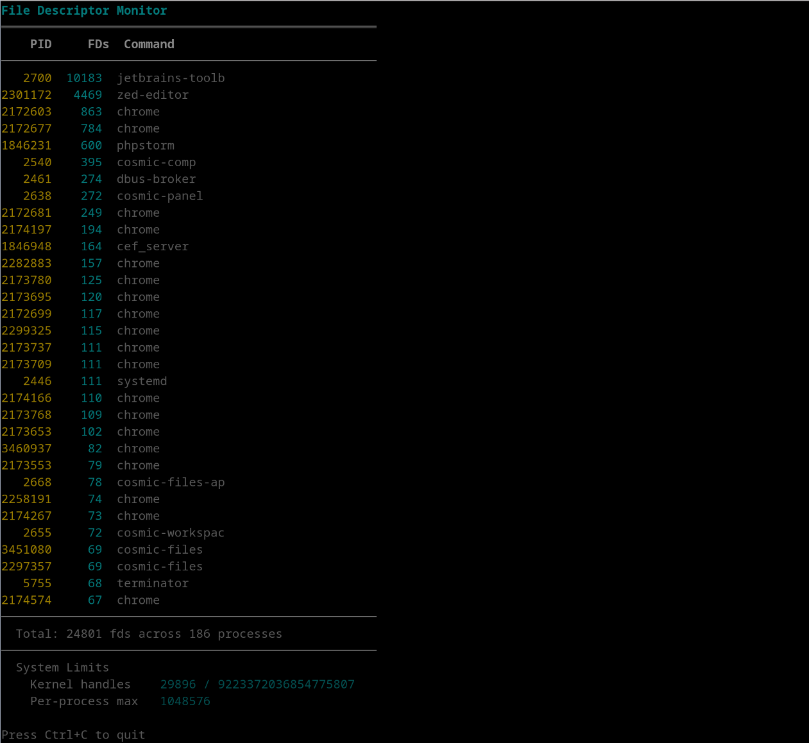

# fdmon

File-descriptor monitor utility. I wanted something quick, here it is. Screenshot says more than words



## What it does

Shows open file descriptors per process, showing 32 processes with most file descriptors open.

## How it does it

Enumerates `/proc/*/fd/` every second - counts open FD's per process and renders them. Also shows system fd limits from `/proc/sys/fs/`. Useful for spotting fd leaks or resource-hungry processes at a glance (I'm looking at you JetBrains products).

## Install

Requires `nasm` and a GNU linker on x86_64 Linux:

```bash
sudo apt install nasm    # Debian/Ubuntu
sudo pacman -S nasm      # Arch
sudo dnf install nasm    # Fedora
```

## Build & run

```bash
make
./fdmon
```

## License

Public domain
