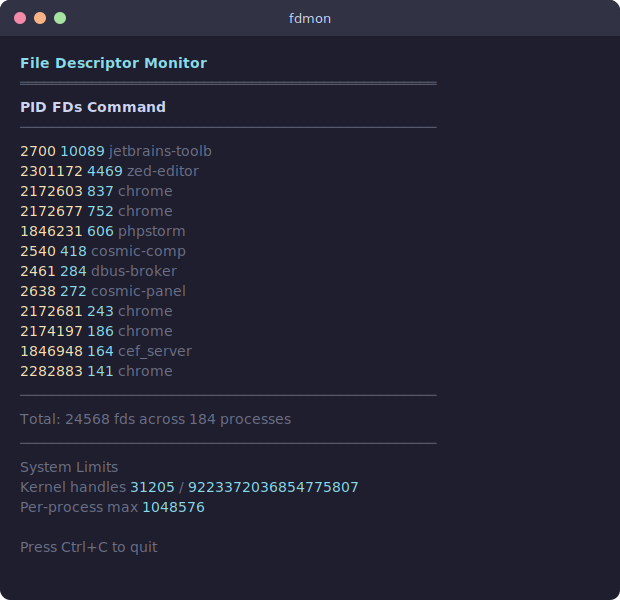

# fdmon

A live file descriptor monitor for the terminal, written entirely in x86_64 Linux assembly. No libc, no dependencies — just raw syscalls.



## What it does

Enumerates `/proc/*/fd/` every second, counts open file descriptors per process, and displays a sorted table with the heaviest fd consumers on top. Also shows system fd limits from `/proc/sys/fs/`. Useful for spotting fd leaks or resource-hungry processes at a glance.

## Install

Requires `nasm` and a GNU linker on x86_64 Linux:

```bash
sudo apt install nasm    # Debian/Ubuntu
sudo pacman -S nasm      # Arch
sudo dnf install nasm    # Fedora
```

## Build & run

```bash
make
./fdmon
```

Press `Ctrl+C` to quit.

Running as root shows all processes. As a regular user, only your own processes are visible.

## How it works

The entire program is a single `.asm` file. It uses eight Linux syscalls directly:

| Syscall | # | Purpose |
|---|---|---|
| `read` | 0 | Read `/proc/pid/comm`, `/proc/sys/fs/*` |
| `write` | 1 | Print to terminal |
| `open` | 2 | Open `/proc`, `/proc/pid/fd`, `/proc/pid/comm`, `/proc/sys/fs/*` |
| `close` | 3 | Close file descriptors |
| `rt_sigaction` | 13 | Handle Ctrl+C (restore cursor) |
| `nanosleep` | 35 | 1-second delay between updates |
| `exit` | 60 | Clean exit |
| `getdents64` | 217 | Read directory entries |

Each iteration: enumerate PIDs from `/proc` using `getdents64`, count numeric entries in each `/proc/pid/fd/` directory, read process names from `/proc/pid/comm`, sort by fd count descending, display the top 32. System limits are read from `/proc/sys/fs/file-nr`, `/proc/sys/fs/file-max`, and `/proc/sys/fs/nr_open`.

All rendering is buffered in memory and flushed with a single `write()` syscall per frame.

## License

Public domain
